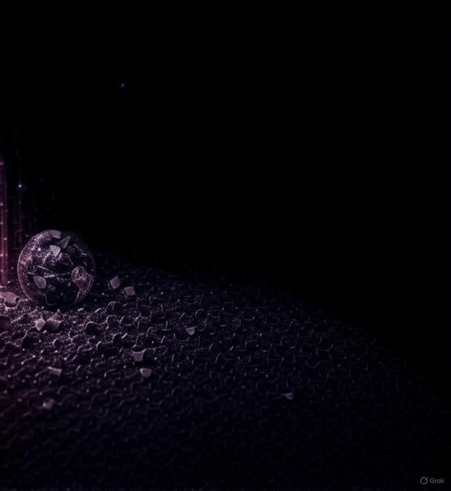
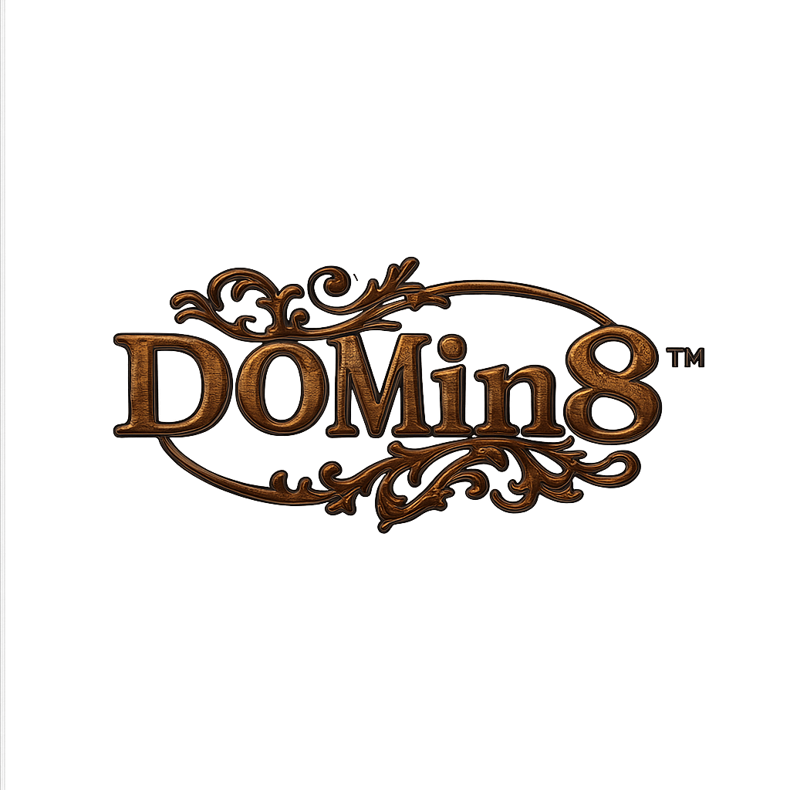

# DOMin8CrypTrX-Grok
transparent logo labelling for images and media

DOMin8CrypTrX-Grok/\n
├── node_modules/          (Generated by npm install)\n
├── public/                (Static files for frontend)\n
│   └── index.html         (Uploader interface)\n
├── src/                   (React components, optional for sign-in)\n
│   ├── index.js           (Entry point for React)\n
│   └── components/        (Sign-in component)\n
│       └── SignIn.js      (Sign-in form)\n
├── server.js              (Backend server logic)\n
└── package.json           (Project configuration)\n

# DOMin8™ CrypTrX™ 🧬

Welcome to DOMin8™ CrypTrX™, a tool for transparent logo labelling of images, videos, and 3D assets with encryption.

## Logo App Background of purple crystals

## DOMin8™ Logo Sample Output

## DOMin8™ Image+Logo Sample Output
"

## File Structure

## 
